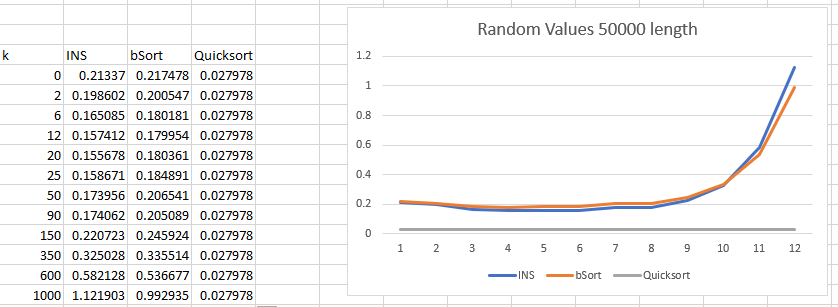
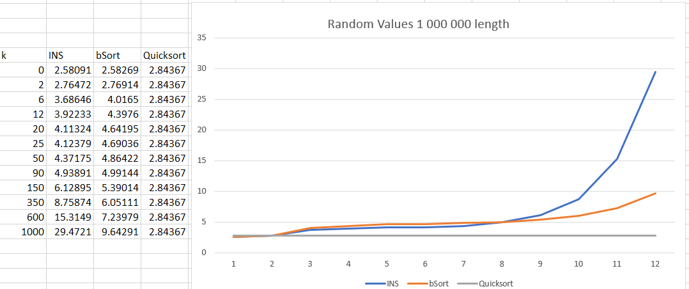

# Analysis-of-sorting-algorithms (INTRO VERSION)

**Abstract**

Read the full report. 
Analyzing modified versions of two different algorithms. We are investigating the time complex of a modified version of merge sort.

**Theory**

Even though the binary search might only require logarithmic time. The time for the placement would still require a squared amount of time in the worst case scenario. Hence the worst case and average cost for insertionsort with binary search would still be θ(n^2) but the best case would be Ω(n) because binary search always gets the best case θ(1)and we skip the loop. 

